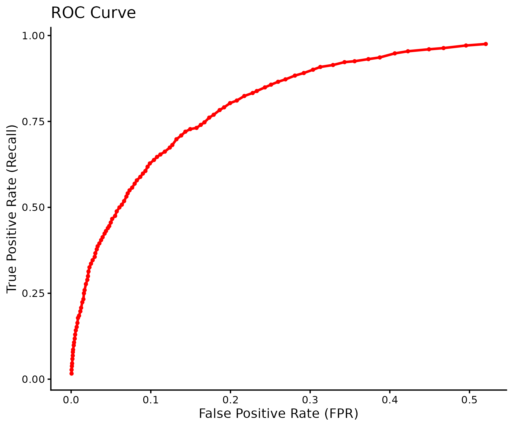

```markdown
---
output: github_document
---

# m6APrediction: A Tool for Predicting m6A Modification Sites

`m6APrediction` is an R package designed to predict N6-methyladenosine (m6A) modification sites in RNA. It uses a pre-trained random forest model that leverages a variety of biological features to make predictions.

## Installation

You can install the development version of `m6APrediction` from GitHub with:

```r
# install.packages("devtools")
devtools::install_github("YourGitHubUserName/m6APrediction")
```   

## Example Usage

Here is a basic example showing how to use the prediction functions.

```{r, eval=FALSE}
library(m6APrediction)
rf_model <- readRDS(system.file("extdata", "rf_fit.rds", package = "m6APrediction"))
 ```
 
## Model Performance

The underlying random forest model demonstrates strong predictive performance.

### ROC Curve
 

### PRC Curve
```


